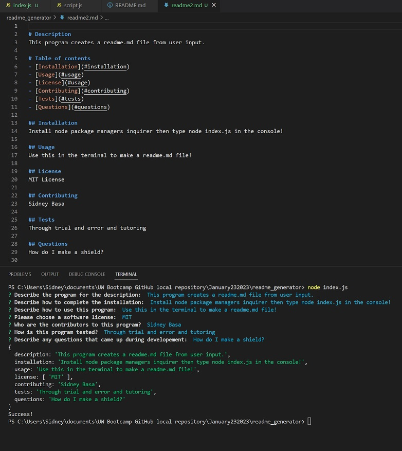

# Description
test

# Table of contents
- [Installation](#installation)
- [Usage](#usage)
- [License](#usage)
- [Contributing](#contributing)
- [Tests](#tests)
- [Questions](#questions)

## Installation
test

## Usage
tes

## License
MIT License

## Contributing
test

## Tests
test

## Questions
test
